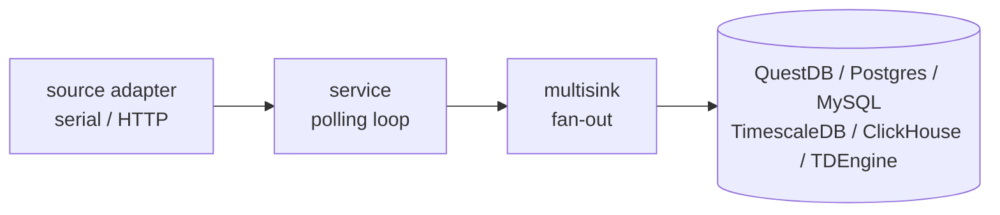

# MeterLogger

[](https://github.com/yottabytesolutions/meterlogger/actions/workflows/ci.yml?query=branch%3Amaster)
[](https://github.com/yottabytesolutions/meterlogger/security/code-scanning)
[](https://github.com/yottabytesolutions/meterlogger/releases/latest)
[](LICENSE)

A Go service that reads data from utility meters and writes it to one or more
time-series or relational databases.

Open source under the MIT license. See [LICENSE](LICENSE) and
[CONTRIBUTING.md](CONTRIBUTING.md). Pull requests are welcome.

## What it does

Each MeterLogger process polls one type of meter on a configured interval and
fans the readings out to every enabled sink, concurrently. Reads and writes
flow through a clean architecture: `source -> service -> multisink -> sinks`.

The deployment model is one container per source. Use a separate container
for each meter type you want to read.

## Supported sources

| Source        | Protocol                  | Connection                  |
|---------------|---------------------------|-----------------------------|
| `heat`        | M-Bus (EN 13757) or optical (Kamstrup KMP, Multical 401/66C) | USB M-Bus adapter or IR read head |
| `grid`        | DSMR P1 smart meter (NL, BE Fluvius, LU Smarty, AT Sagemcom T210-D) or German SML meter via IR read head, plus gas, water and thermal meter readings via the P1 M-Bus channels when enabled | USB-to-P1 serial cable or IR read head |

| `solar`       | Enphase Envoy HTTP API    | Local network               |
| `ventilation` | DucoBox HTTP API          | Local network               |

## Supported sinks

| Sink        | Type                 | Auto-migration    |
|-------------|----------------------|-------------------|
| QuestDB     | time-series, ILP/TCP | automatic via ILP |
| PostgreSQL  | relational           | yes               |
| MySQL       | relational           | yes               |
| TimescaleDB | PostgreSQL extension | yes               |
| ClickHouse  | column-store, OLAP   | yes               |
| TDEngine    | time-series, IoT     | yes               |
| MQTT        | message broker, HA   | n/a               |
| Stdout      | debug, logs records  | n/a               |

At least one sink must be enabled. All enabled sinks receive every write.
The stdout sink logs data instead of persisting it; enable it with
`Stdout.Enabled: true` for debugging, not for production.
The MQTT sink publishes every reading to a broker and announces the sensors
to Home Assistant via MQTT discovery; see
[deployment.md](documentation/deployment.md#home-assistant).

## Quick start

Build the binaries:

```sh
make build
```

This produces three binaries in `out/`:

- `out/meterlogger-linux-amd64`
- `out/meterlogger-linux-arm64`
- `out/meterlogger-darwin-arm64`

Pick one and run it. Sources run when their `Enabled` flag is true in the
config, or when selected with `--source`:

```sh
./out/meterlogger-linux-amd64 --source heat
./out/meterlogger-linux-amd64 --source grid
./out/meterlogger-linux-amd64 --source solar
./out/meterlogger-linux-amd64 --source ventilation --debug
```

Minimal config (`~/.meterlogger.yaml`):

```yaml
FlushInterval: 10s

QuestDB:
  Enabled: true
  Host: localhost
  Port: 9009
  User: admin
  Password: quest

Heat:
  Enabled: true
  Measurement: heat_meter
  SerialInterface: /dev/ttyUSB0
  MbusAddress: 1
  ScrapeInterval: 30s
```

See [documentation/configuration.md](documentation/configuration.md) for every
configuration key and a full example.

## Docker

```sh
docker build --build-arg GIT_SHA=$(git rev-parse --short HEAD) -t yottabyte/meterlogger .
docker compose up
```

The container is a two-stage scratch build. It contains only `/meterlogger`,
CA certificates, and a non-root user record. The `HEALTHCHECK` directive runs
`meterlogger healthcheck`, which probes `/readyz`.

See [documentation/deployment.md](documentation/deployment.md) for a full
multi-source docker-compose example, [deploy/kubernetes.yaml](deploy/kubernetes.yaml)
for a Kubernetes equivalent, and [deploy/systemd/](deploy/systemd/) for running
without containers.

## Documentation

| Document                                                         | Contents                                                           |
|------------------------------------------------------------------|--------------------------------------------------------------------|
| [documentation/architecture.md](documentation/architecture.md)   | Package structure, dependency graph, design patterns               |
| [documentation/configuration.md](documentation/configuration.md) | All configuration options with annotated examples                  |
| [documentation/meter-types.md](documentation/meter-types.md)     | Per-source deep dive: protocols, hardware, read flows              |
| [documentation/data-model.md](documentation/data-model.md)       | Domain types and database table schemas                            |
| [documentation/deployment.md](documentation/deployment.md)       | Building, running locally, Docker, docker-compose, Kubernetes      |
| [documentation/observability.md](documentation/observability.md) | Health endpoints, Prometheus metrics, tracing, profiling, alerting |
| [documentation/troubleshooting.md](documentation/troubleshooting.md) | Common first-run problems and how to diagnose them             |
| [documentation/README.md](documentation/README.md)               | Documentation index and quick orientation                          |
| [CONTRIBUTING.md](CONTRIBUTING.md)                               | How to propose changes                                             |
| [SECURITY.md](SECURITY.md)                                       | Security disclosure process                                        |
| [AGENTS.md](AGENTS.md)                                           | Architectural rules and code style enforced for every change       |

## Architecture at a glance



The service layer depends only on interfaces in `internal/domain/`. Source
and sink implementations are injected at startup and are interchangeable.

## Tech stack

| Concern        | Library                                                            |
|----------------|--------------------------------------------------------------------|
| CLI            | [cobra](https://github.com/spf13/cobra)                            |
| Config         | [viper](https://github.com/spf13/viper)                            |
| Logging        | [`log/slog`](https://pkg.go.dev/log/slog) (standard library)       |
| Tracing        | [OpenTelemetry](https://opentelemetry.io/)                         |
| Profiling      | [Pyroscope](https://github.com/grafana/pyroscope-go)               |
| QuestDB        | [QuestDB ILP client](https://github.com/questdb/go-questdb-client) |
| PostgreSQL     | [pgx](https://github.com/jackc/pgx)                                |
| MySQL          | [go-sql-driver/mysql](https://github.com/go-sql-driver/mysql)      |
| ClickHouse     | [clickhouse-go](https://github.com/ClickHouse/clickhouse-go)       |
| TDEngine       | [taosdata/driver-go](https://github.com/taosdata/driver-go)        |
| Serial port    | [go.bug.st/serial](https://pkg.go.dev/go.bug.st/serial)            |
| M-Bus decoding | [yottabytesolutions/gombus](https://github.com/yottabytesolutions/gombus) (project's own maintained fork) |
| JWT            | [golang-jwt/jwt](https://github.com/golang-jwt/jwt)                |
| Tests          | [DATA-DOG/go-sqlmock](https://github.com/DATA-DOG/go-sqlmock)      |

## License

[MIT](LICENSE). Copyright (c) 2026 Yottabyte Solutions.
