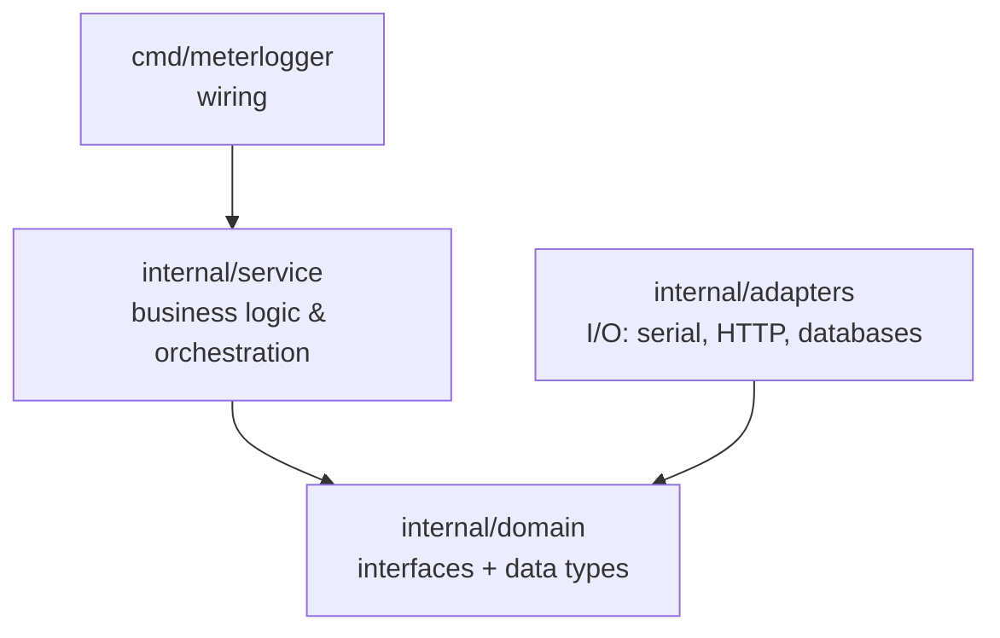
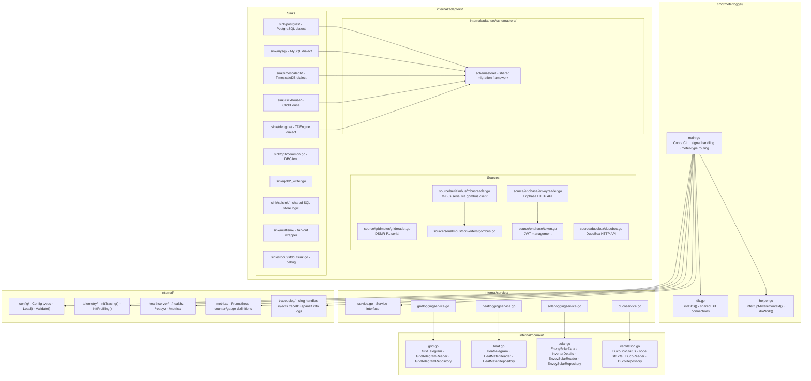
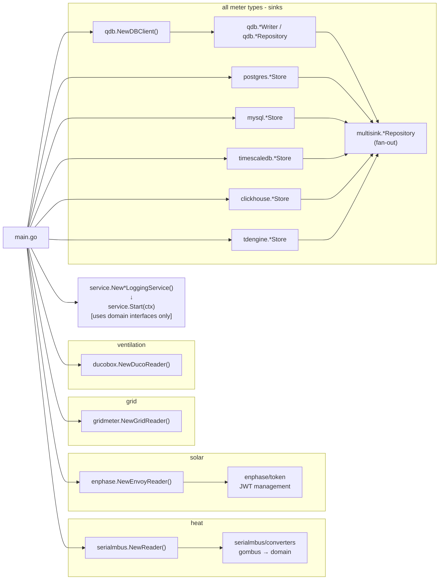

# Architecture

> Related: [configuration.md](./configuration.md) · [data-model.md](./data-model.md) · [deployment.md](./deployment.md)

## Overview

MeterLogger follows a clean architecture with three explicit layers:



The domain layer defines **what** the system does (interfaces). The adapter layer defines **how** it connects to the
outside world (implementations). The service layer connects them.

Services depend only on `internal/domain` interfaces - they never import an adapter package directly. This is the core
architectural invariant.

---

## Package map



---

## Dependency graph



---

## Service lifecycle

Every meter type uses the same startup sequence:

```go
// 1. Construct reader adapter
reader := someadapter.NewReader(...)

// 2. Construct sink stores + fan-out repository
store1 := qdb.NewXxxWriter(client, tableName, logger)
store2 := postgres.NewXxxStore(ctx, pgDB, tableName, logger)
repo := multisink.NewXxxRepository([]domain.XxxRepository{store1, store2}, logger)

// 3. Construct service
svc := service.NewXxxLoggingService(reader, repo, intervals, logger)

// 4. Block until context is cancelled
startService(ctx, logger, "Human readable name", svc)

// 5. Deferred cleanup
defer repo.Close()
```

`startService` runs `svc.Start(ctx)` in a goroutine and waits for it to finish via a `sync.WaitGroup`.

---

## Polling & flushing

Every service uses two `time.Ticker` values:

| Ticker        | Controls                              | Typical interval                 |
|---------------|---------------------------------------|----------------------------------|
| `ticker`      | How often to read from the source     | 30s to 5min                      |
| `flushTicker` | How often to flush the QuestDB buffer | configurable via `FlushInterval` |

The QuestDB client accumulates records in memory (line protocol buffer) and sends them in bulk on flush. If flushing
fails, the service sends `SIGTERM` to itself to trigger a clean shutdown.

---

## Error handling strategy

| Situation                                   | Behaviour                                                        |
|---------------------------------------------|------------------------------------------------------------------|
| Fatal startup error (port open, DB connect) | `log.Fatal` - exits immediately                                  |
| Read error (heat/solar/grid)                | Logs error, increments `read_errors_total`, retries on next tick |
| Ventilation read/store error                | Logs error, sends `SIGTERM`, returns from service loop           |
| Store error (heat/solar/grid)               | Logs error, sends `SIGTERM`, returns from service loop           |
| Flush error                                 | Logs error, sends `SIGTERM`, returns from service loop           |
| Context cancelled (SIGINT/SIGTERM)          | All services stop cleanly, QuestDB connection flushed and closed |

The design is intentionally fail-fast. It relies on the container restart policy (`restart: always` in docker-compose)
to recover from transient hardware errors.

---

## Design patterns

### Interface-based adapter pattern

The domain layer defines minimal interfaces:

```go
// internal/domain/heat.go
type HeatMeterReader interface {
ReadHeatTelegram() (HeatTelegram, error)
}

type HeatMeterRepository interface {
StoreHeatTelegram(ctx context.Context, telegram HeatTelegram) error
Flush(ctx context.Context) error
}
```

Services are constructed with these interfaces. This makes the `stdout` adapter, the `qdb` adapter, and any future
adapter interchangeable without changing service code.

### Constructor injection

All structs are constructed via `NewXxx(...)` functions. There are no global state mutations after startup.

### Context propagation

`context.Context` flows from `main.go` down through services into every repository call. The context is cancelled on OS
signal, which unwinds all blocking select loops.

### Fail-fast with SIGTERM

When a service encounters a non-recoverable error it calls:

```go
_ = syscall.Kill(syscall.Getpid(), syscall.SIGTERM)
return
```

This triggers the signal handler in `interruptAwareContext()`, which cancels the root context, causing all services to
exit cleanly (including flushing the QuestDB buffer).

### Multi-sink fan-out

`internal/adapters/sink/multisink/` wraps a slice of repositories and forwards every write concurrently to all of them.
A single write failure is logged but does not block the other sinks. This lets you write to QuestDB, PostgreSQL, and
ClickHouse simultaneously with a single `StoreXxx` call from the service layer.
