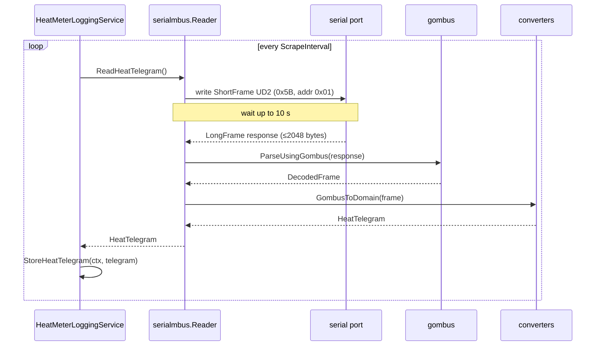
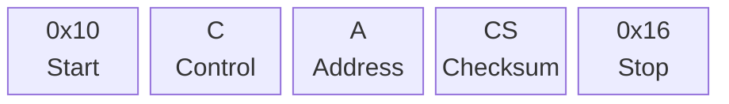
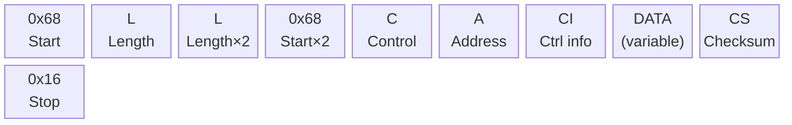
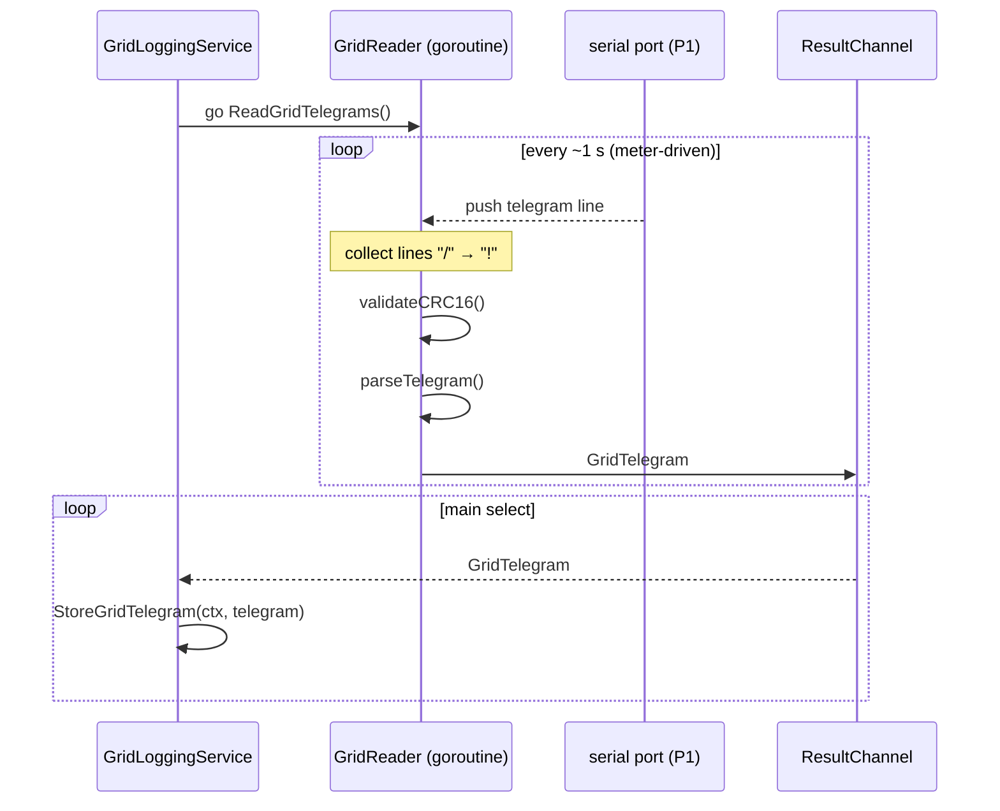
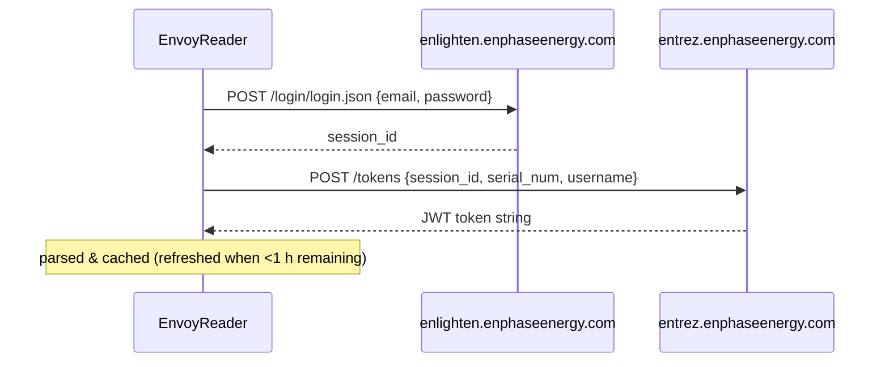
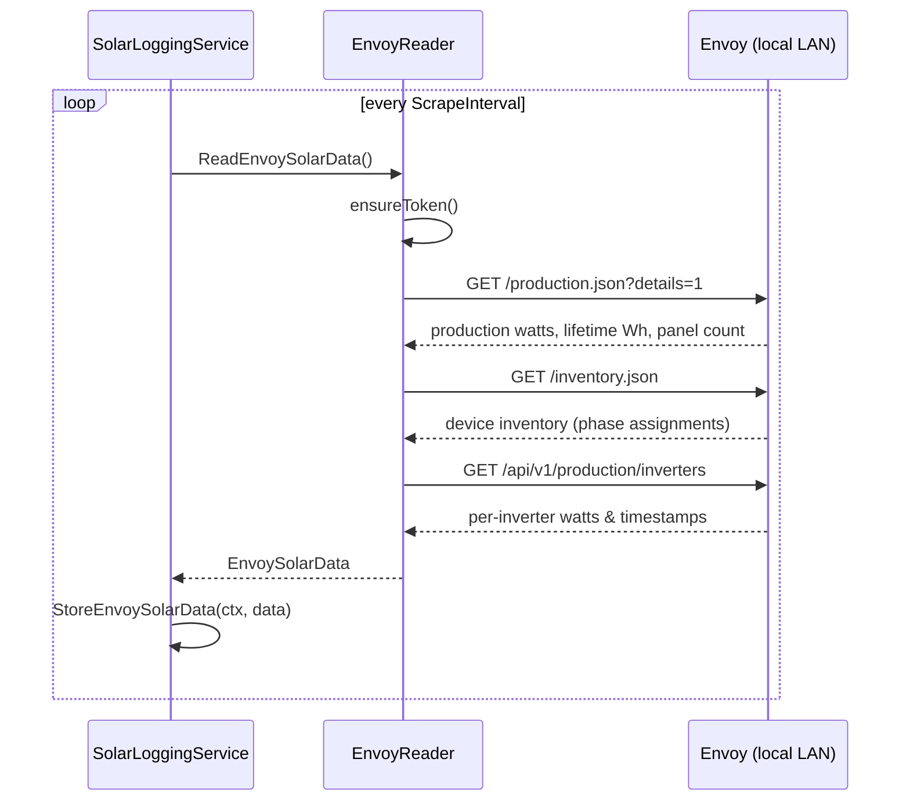

# Meter types

>
Related: [configuration.md](./configuration.md) · [data-model.md](./data-model.md) · [architecture.md](./architecture.md)

This document covers each supported meter type: the physical protocol, how data flows through the code, and anything
non-obvious about the implementation.

---

## Heat meter (M-Bus)

### Hardware

The heat meter communicates over [M-Bus](https://m-bus.com/) (Meter-Bus, EN 13757). The physical connection is a
USB-to-M-Bus converter (e.g. based on the Relay W-Bus or similar). The converter appears as a USB serial device on the
host.

Serial settings (fixed in code):

| Parameter    | Value  |
|--------------|--------|
| Baud rate    | 9600   |
| Parity       | Even   |
| Stop bits    | 1      |
| Read timeout | 300 ms |

### Read flow



### M-Bus frame format

**Short frame (request):**



**Long frame (response):**



### Initialisation

On startup, the reader sends an init frame (Control=0x40, Address=0xFD - the broadcast address) and waits 300 ms. An EOF
error on init is tolerated; other errors are fatal. `Reader.ResetPort()` can reopen and reinitialise the serial port for
error recovery.

### Data record mapping

The converter (`converters/gombus.go`) searches the M-Bus data records by unit type and measurement function:

| Unit type | Function      | HeatTelegram field    |
|-----------|---------------|-----------------------|
| 15        | Instantaneous | Joules (total energy) |
| 23        | Instantaneous | VolumeCm3             |
| 35        | Instantaneous | SecondsCounter        |
| 47        | Instantaneous | ActualPower           |
| 47        | Maximum       | MaxPower              |
| 63        | Instantaneous | ActualFlow            |
| 63        | Maximum       | MaxFlow               |
| 91        | Instantaneous | Tforward (°C)         |
| 95        | Instantaneous | Treturn (°C)          |
| 99        | Instantaneous | Tdiff (°C)            |

`MeterId` is formatted as `"{Manufacturer} ({DeviceType})"` using values from the M-Bus slave information header.

---

## Grid meter (DSMR P1)

### Hardware

Dutch smart meters expose a P1 port that pushes a telegram every second. The port uses an RJ-11 connector at 115200
baud. A USB-to-serial cable with an RJ-11 adapter is required.

Serial settings (fixed in code):

| Parameter | Value  |
|-----------|--------|
| Baud rate | 115200 |
| Parity    | None   |
| Stop bits | 1      |

### Read flow



### Telegram format

P1 telegrams are text-based with OBIS codes:

```
/MSN5\MSN-MSN-MSN

0-0:1.0.0(200101120000W)
1-0:1.8.1(001234.567*kWh)
1-0:1.8.2(002345.678*kWh)
1-0:2.8.1(000100.001*kWh)
1-0:2.8.2(000200.002*kWh)
1-0:1.7.0(0001.500*kW)
...
!A1B2
```

The `!` line contains the CRC16 checksum (hex). The reader validates the checksum before parsing.

### Unit conversions

Power values in the P1 telegram are in kW; they are converted to W (×1000) before storing. All other values are stored
as-is.

Timestamps use the `Europe/Amsterdam` timezone.

### CRC validation

The reader computes CRC16-CCITT over the full message (from `/` to and including `!`) and compares it against the
4-character hex value that follows `!`.

---

## Solar meter (Enphase Envoy)

### Hardware

The [Enphase Envoy](https://enphase.com/homeowners/products/envoy) is a gateway device that communicates with individual
micro-inverters. It exposes a local HTTP API that this adapter queries. The Envoy must be on the same LAN as the host
running MeterLogger.

### Authentication

The Envoy uses JWT tokens. The token is obtained from Enphase cloud services:



The Envoy's TLS certificate is self-signed; TLS verification is disabled in the HTTP client.

### API endpoints used

| Endpoint                           | Purpose                                                   |
|------------------------------------|-----------------------------------------------------------|
| `GET /production.json?details=1`   | Current production watts, lifetime Wh, active panel count |
| `GET /inventory.json`              | Device inventory - used for per-inverter phase assignment |
| `GET /api/v1/production/inverters` | Per-inverter last reported watts, peak watts, timestamps  |

### Data combination

The three API responses are combined into a single `EnvoySolarData`:

- `ProductionWh`, `Watt`, `PanelCount` come from `/production.json` (first `Production` entry with type `eim`)
- `Inverters` list is built from `/api/v1/production/inverters` cross-referenced with `/inventory.json` for phase and
  status information

### Read flow



---

## Ventilation (DucoBox)

### Hardware

The [DucoBox](https://www.duco.eu/) is a residential heat recovery ventilation unit with a local HTTP API (no
authentication required). Nodes are the individual room units (CO₂ sensors, humidity sensors, valve units) connected to
the box.

### API endpoints used

| Endpoint                     | Purpose                                                      |
|------------------------------|--------------------------------------------------------------|
| `GET /boxinfoget`            | Box status: fan speeds, pressures, temperatures, calibration |
| `GET /nodeinfoget?node={id}` | Per-node status - device type determines returned fields     |

### Node type dispatch

The DucoBox returns the same JSON structure for all node types, but the meaningful fields differ by `DevType`. The
adapter handles this by first unmarshalling into `BaseDucoNodeStatus` to read `DevType`, then re-unmarshalling into the
appropriate struct:

| `DevType` | Go type                  | Description                                                    |
|-----------|--------------------------|----------------------------------------------------------------|
| `BOX`     | `DucoNodeBoxStatus`      | Central unit node with CO₂, temp, humidity, target/actual flow |
| `VLV`     | `DucoNodeBoxValveStatus` | Valve unit with target/actual position                         |
| `UCCO2`   | `DucoRFSensorStatus`     | Wireless CO₂ sensor                                            |
| `UCRH`    | `DucoRFSensorStatus`     | Wireless humidity sensor                                       |

Nodes with unknown device types cause an error but the service tolerates up to 20 consecutive errors before shutting
down.

### Sensor value correction

Some firmware versions of UCRH and UCCO2 nodes return CO₂ and humidity values in the wrong fields. The
`ValidateAndFix()` method corrects this:

```go
// UCRH: humidity sensor reporting CO2 value in Co2 field, Rh=0
if node.DevType == "UCRH" && node.Co2 > 0 && node.Rh == 0 {
node.Rh, node.Co2 = node.Co2, 0
}
// UCCO2: CO2 sensor reporting humidity in Rh field, Co2=0
if node.DevType == "UCCO2" && node.Rh > 0 && node.Co2 == 0 {
node.Co2, node.Rh = node.Rh, 0
}
```

### Error tolerance

The `DucoLoggingService` uses a `maxErrorCount` constant (20) to tolerate transient failures. The error counter resets
on a successful read. Errors from nodes that return `"UNKN"` as their type are silently ignored (they do not increment
the counter).

### Read flow

```mermaid
sequenceDiagram
    participant S as DucoLoggingService
    participant R as DucoReader
    participant Box as DucoBox (local LAN)

    loop every ScrapeInterval
        S ->> R: ReadBoxStatus(ctx)
        R ->> Box: GET /boxinfoget
        Box -->> R: DucoBoxStatus JSON
        R -->> S: DucoBoxStatus
        S ->> S: StoreBoxStatus(ctx, status)

        loop for each node ID in config
            S ->> R: ReadNodeStatus(ctx, nodeID)
            R ->> Box: GET /nodeinfoget?node={id}
            Box -->> R: node JSON
            R ->> R: ParseDucoNodeStatus() - dispatch by DevType
            R -->> S: DucoNodeBoxStatus | DucoRFSensorStatus | DucoNodeBoxValveStatus
            S ->> S: StoreNodeData(ctx, nodeData)
        end
    end
```

The `DucoReader` keeps a persistent `*http.Client` with keep-alive enabled so
repeated polls reuse the same TCP connection and do not re-resolve DNS on
every fetch.
